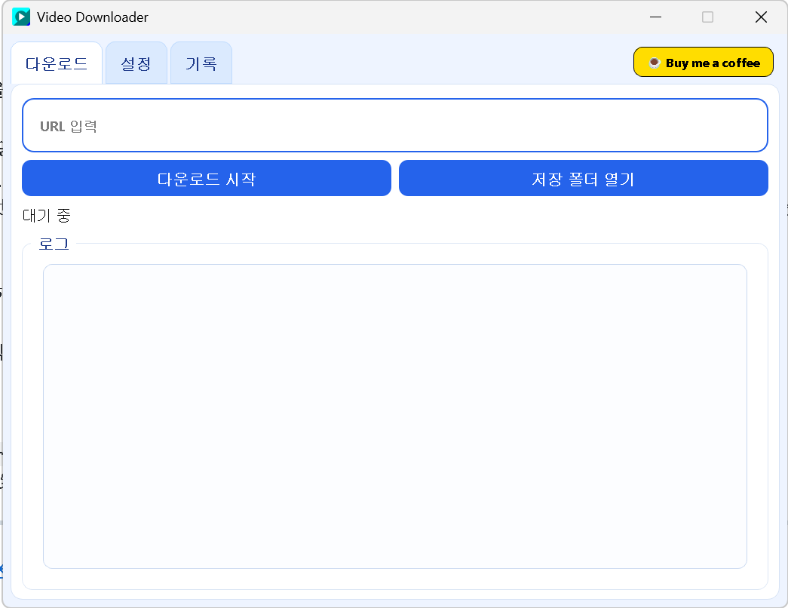

<p align="center">
  
</p>

<h1 align="center">🎬 Video Downloader</h1>

<p align="center">
  <strong>URL 하나로 공개 영상을 안전하게 백업하는 데스크탑 앱</strong>
</p>

<p align="center">
  
  
  
  
</p>

<p align="center">
  <a href="https://github.com/weallnoob/Video_Downloader/releases/tag/Installer">
    
  </a>
  &nbsp;
  <a href="https://www.buymeacoffee.com/aminora">
    
  </a>
</p>

---

## ✨ 주요 특징

- 🖱️ **원클릭 다운로드:** 복잡한 설정 없이 URL 복붙 후 버튼 한 번으로 즉시 백업
- 🛡️ **안전한 정책 보호:** 유료 OTT 및 DRM 콘텐츠 자동 차단, 60+ 공개 플랫폼만 허용
- 🍪 **프라이버시 보장:** 브라우저 쿠키 및 개인 로그인 세션을 절대 수집하지 않음
- ⚡ **초고속 병렬 다운로드:** `aria2c`를 통한 16-way 분할 다운로드로 압도적인 속도 제공
- 🎛️ **세밀한 화질 및 음질 제어:** 4K 비디오부터 사용자 맞춤 오디오 포맷(MP3, M4A 등) 강제 변환
- 📋 **통합 이력 관리:** 방대한 다운로드 기록, 썸네일 제공 및 클릭 한 번으로 손쉬운 재시도
- 🎨 **모던 데스크탑 UI:** 라운드 디자인 요소와 블루 테마가 반영된 쾌적한 작업 환경 보장

---

## 🚀 설치하기



### 일반 사용자

1. [**Releases**](https://github.com/weallnoob/Video_Downloader/releases/tag/Installer) 페이지에서 `VideoDownloaderInstaller.exe`를 다운로드합니다.
2. 설치 파일을 실행합니다. (설치 중 `yt-dlp`, `aria2c`, `ffmpeg`를 자동으로 다운로드합니다)
3. 바탕 화면 아이콘 또는 시작 메뉴에서 **Video Downloader**를 실행합니다.

> **💡 인터넷 연결이 필요합니다** — 설치 시 필수 바이너리를 온라인으로 구성합니다.

### 개발자

```powershell
# 의존성 설치
python -m pip install -r requirements.txt

# 직접 실행
python app.py
```

---

## 🔧 빌드 (개발자용)

빌드를 위해 [**Inno Setup 6**](https://jrsoftware.org/isdl.php)이 필요합니다.

```powershell
# 전체 빌드 (PyInstaller → Inno Setup 인스톨러)
.\build.ps1

# 빌드 옵션
.\build.ps1 -OfflineMode              # 오프라인 모드
.\build.ps1 -SkipInstaller            # 앱 폴더 빌드만
.\build.ps1 -SkipInstall -SkipDownload # 패키지 설치/다운로드 건너뛰기
```

<details>
<summary>📦 <b>빌드 파이프라인 상세</b></summary>

| 단계 | 설명 |
|------|------|
| 1. 패키지 설치 | `requirements-build.txt` 기반 Python 패키지 설치 |
| 2. PyInstaller | `VideoDownloader.spec`으로 앱 번들 생성 (`dist/VideoDownloader/`) |
| 3. 용량 최적화 | `yt_dlp`, `cryptography`, `curl_cffi` 모듈 및 `opengl32sw.dll` 제외 |
| 4. Inno Setup | 단일 설치 파일 생성 → `dist/VideoDownloaderInstaller.exe` |

- 인스톨러는 **온라인 모드**(기본)로 동작 — `yt-dlp.exe`, `aria2c.exe`, `ffmpeg.exe`를 설치 시 자동 다운로드
- 인스톨러 용량을 **최소화**하기 위해 대용량 바이너리를 번들에 포함하지 않음

</details>

---

## 🌐 지원 플랫폼

<details>
<summary>✅ <b>허용 플랫폼 (60+)</b> — 클릭하여 펼치기</summary>

| 카테고리 | 플랫폼 |
|---------|--------|
| **글로벌 영상** | YouTube, Vimeo, Dailymotion, Rumble, Odysee, BitChute, PeerTube, DTube |
| **소셜 미디어** | Facebook Watch, Instagram, X/Twitter, TikTok, Snapchat, Triller, LinkedIn |
| **라이브 스트리밍** | Twitch, Kick, Trovo, AfreecaTV, Chzzk |
| **한국** | Naver TV, KakaoTV, AfreecaTV, Chzzk |
| **중국** | Bilibili, Youku, iQIYI, Tencent Video, Douyin, AcFun, Mango TV |
| **일본/러시아** | Niconico, NHK World, VK Video, Rutube |
| **공영 방송** | BBC iPlayer, ITVX, All 4, My5, ARD, ZDF, France.tv |
| **뉴스/교육** | TED, Coursera, Udemy, Al Jazeera, Bloomberg, CNN |
| **무료 스트리밍** | Tubi, Pluto TV, Crackle, FilmRise, MagellanTV |

</details>

<details>
<summary>🚫 <b>차단 플랫폼 (유료 OTT)</b></summary>

Netflix, Hulu, Amazon Prime Video, Disney+, Apple TV+, HBO Max, Paramount+,
Peacock, Crunchyroll, YouTube TV, ESPN+, Discovery+, FuboTV, Sling TV 등

</details>

---

## 🏗️ 기술 스택

| 구성 요소 | 기술 | 역할 |
|-----------|------|------|
| **GUI** | PySide6 (Qt 6, LGPL) | 크로스 플랫폼 데스크톱 UI |
| **다운로더** | yt-dlp | 스트림 추출 및 다운로드 엔진 |
| **가속기** | aria2c | 16-way 병렬 다운로드 |
| **후처리** | ffmpeg | 비디오/오디오 병합 및 변환 |
| **빌드** | PyInstaller + Inno Setup | 단일 설치 파일 생성 |

---

## ⚖️ Legal Notice

<details>
<summary><b>법적 고지 전문 보기</b></summary>

- 앱 실행 시 **법적 고지 동의 팝업**이 표시되며, 미동의 시 프로그램 사용이 불가합니다.
- 본 도구는 **합법적 콘텐츠**에 한해 사용됩니다.
- 저작권자 허락 없는 콘텐츠 다운로드를 **금지**합니다.
- 다운로드한 콘텐츠의 판매, 공유, 재배포, 업로드, 상업적 이용을 **엄격히 금지**합니다.
- 위 금지행위 위반으로 발생하는 모든 민형사상 책임은 **전적으로 사용자**에게 있습니다.
- **DRM 보호 콘텐츠**는 지원하지 않으며, 감지 시 차단됩니다.
- 로그인 세션/브라우저 쿠키 자동 추출 기능을 **제공하지 않습니다**.
- 사용자는 관련 법률 및 플랫폼 약관을 준수해야 합니다.
- 본 프로젝트는 DRM 우회 기능을 **포함하지 않습니다**.

</details>

## 📬 DMCA / 신고 대응

침해 신고 접수 시 즉시 검토 및 필요한 조치를 진행합니다.
이슈 발생시 Issues에 문의바랍니다.

---

## ☕ 후원하기

이 프로젝트가 유용하셨다면 커피 한 잔 사주세요!

<a href="https://www.buymeacoffee.com/aminora">
  
</a>

---

<p align="center">
  Made with ❤️ for the open-source community
</p>
